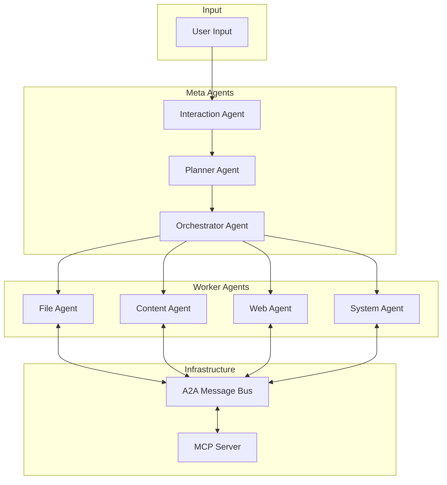
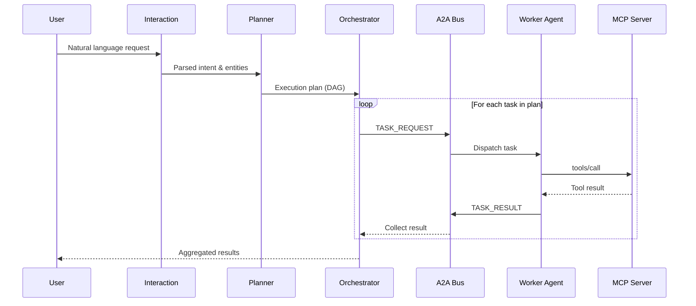
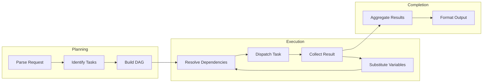
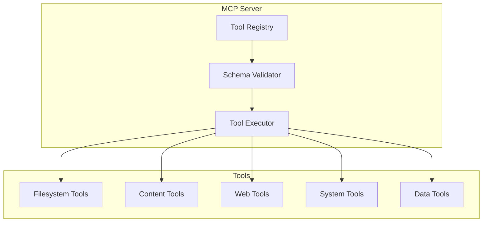

# Synapse

Synapse is a multi-agent orchestration system that demonstrates the power of combining Agent-to-Agent (A2A) communication protocols with the Model Context Protocol (MCP) for tool abstraction. Built as a proof-of-concept for enterprise-grade agent workflows, Synapse showcases how multiple AI agents can collaborate autonomously to accomplish complex tasks through natural language instructions.

The system operates on a simple principle: when you describe what you want to accomplish, Synapse breaks down your request into discrete tasks, assigns each task to a specialized agent, manages dependencies between tasks, and orchestrates the entire execution flow. Each agent possesses its own reasoning capabilities powered by a Large Language Model, enabling truly autonomous decision-making rather than simple rule-based tool execution.

## System Architecture

The architecture follows a hierarchical flow where user requests pass through multiple processing stages before reaching the worker agents that execute the actual tasks.



## Agent Communication Flow

When a request is processed, agents communicate through the A2A message bus using a structured message protocol. The orchestrator dispatches tasks and collects results through this centralized communication channel.



## Task Execution Pipeline

The planner creates a Directed Acyclic Graph (DAG) of tasks where some tasks may depend on the outputs of others. The orchestrator resolves these dependencies and executes tasks in the correct order.



## MCP Tool Registry

The Model Context Protocol server maintains a registry of all available tools with their schemas, enabling dynamic tool discovery and validation.



## Available Agents

Synapse includes five specialized worker agents, each designed for a specific domain of operations. The meta agents (Interaction, Planner, Orchestrator) handle request processing and coordination but do not directly execute tools.

The **File Agent** handles all filesystem operations including reading and writing files, creating and deleting directories, moving and copying files, and searching for files by pattern. It automatically resolves paths relative to the current working directory and handles cross-platform path differences.

The **Content Agent** leverages AI capabilities to generate and transform text content. It can write articles, summaries, and other textual content based on prompts, and can summarize existing content into concise forms.

The **Web Agent** interacts with external web resources, fetching webpage content and extracting readable text, as well as downloading files from URLs to local storage.

The **System Agent** provides access to system-level operations including running shell commands, retrieving system information, getting the current date and time, and evaluating mathematical expressions safely.

The **Data Agent** specializes in structured data formats, reading and writing JSON files for configuration and data storage, and handling CSV files for tabular data operations.

## Installation

Navigate to the synapse directory and run the appropriate setup script for your operating system. The setup script installs all required dependencies and configures the `synapse` command for your terminal.

### Windows
```powershell
cd synapse
python setup/setup_windows.py
```
After setup completes, open a new PowerShell window and type `synapse` to start the CLI.

### macOS
```bash
cd synapse
python3 setup/setup_mac.py
```
After setup completes, open a new terminal window and type `synapse` to start the CLI.

### Linux
```bash
cd synapse
python3 setup/setup_linux.py
```
After setup completes, open a new terminal window or run `source ~/.bashrc`, then type `synapse` to start the CLI.

### Manual Installation
If you prefer to run without installing the command alias:
```bash
cd synapse
pip install -r requirements.txt
python cli.py
```

## Configuration

The API key for the Groq LLM service is stored in the `.env` file in the synapse directory. Edit this file to update your API key:

```
GROQ_API_KEY=your-api-key-here
```

You can obtain a free API key from [Groq Console](https://console.groq.com).

## Usage

The CLI interface provides an interactive environment for executing tasks and exploring the system capabilities. You can either select options from the menu or type your requests directly at the prompt.

### Keyboard Shortcuts
- **h** - Display help information
- **q** - Quit the application
- **Ctrl+L** - View detailed logs for the last executed prompt
- **ESC** - Return to previous menu (in submenu modes)

### Menu Options
1. Execute a task - Enter task execution mode for running multiple prompts
2. View agent tools - Browse available tools by category with examples
3. System status - View agent status and system statistics
4. View execution logs - Browse and inspect logs from previous prompts
5. View raw output - See the complete JSON output from the last execution

### Example Commands
```
List files on my Desktop
What time is it?
Create a folder called Projects on my Desktop
Write an article about artificial intelligence and save it as ai_article.txt
Calculate 256 * 4 + sqrt(144)
Fetch https://example.com and summarize it
```

## Logging System

Synapse maintains detailed execution logs for the last 20 prompts. Each log entry includes the timestamp, original prompt, parsing results, execution plan, task statuses, and any errors encountered. You can access logs through the menu option or by pressing Ctrl+L immediately after a prompt completes.

The logs are stored in `synapse/logs/execution_logs.json` and can be viewed externally if needed.

## Web Interface

In addition to the CLI, Synapse includes a Streamlit-based web interface for visual interaction:

```bash
cd synapse
streamlit run app.py
```

This opens a browser-based interface with tabs for task execution, A2A message inspection, and architecture visualization.

## Project Structure

```
synapse/
├── cli.py              # Command-line interface
├── app.py              # Streamlit web interface  
├── synapse.py          # Main orchestration system
├── config.py           # Configuration settings
├── .env                # API key storage
├── requirements.txt    # Python dependencies
├── setup/              # Platform-specific setup scripts
│   ├── setup_windows.py
│   ├── setup_mac.py
│   └── setup_linux.py
├── agents/             # Agent implementations
│   ├── base_agent.py
│   ├── interaction_agent.py
│   ├── planner_agent.py
│   ├── orchestrator_agent.py
│   ├── file_agent.py
│   ├── content_agent.py
│   ├── web_agent.py
│   └── system_agent.py
├── core/               # Core infrastructure
│   └── a2a_bus.py
├── mcp/                # MCP server implementation
│   └── server.py
├── tools/              # Tool implementations
│   └── all_tools.py
└── logs/               # Execution logs (created at runtime)
    └── execution_logs.json
```

## Technical Details

Synapse uses Groq's LLaMA 3.1 8B Instant model for agent reasoning, chosen for its fast inference speed which enables responsive multi-agent interactions. Each agent maintains its own context and can make autonomous decisions about how to accomplish assigned tasks.

The A2A message bus implements a queue-based communication system with typed messages including TASK_REQUEST, TASK_RESULT, TOOL_REQUEST, TOOL_RESPONSE, STATUS_UPDATE, and ERROR types. This provides visibility into inter-agent communication and enables debugging of complex workflows.

The MCP server maintains a tool registry with JSON Schema definitions for each tool, enabling input validation and providing structured tool descriptions for agent decision-making. Tools are categorized by function (filesystem, content, web, system, data) and automatically registered at startup.
